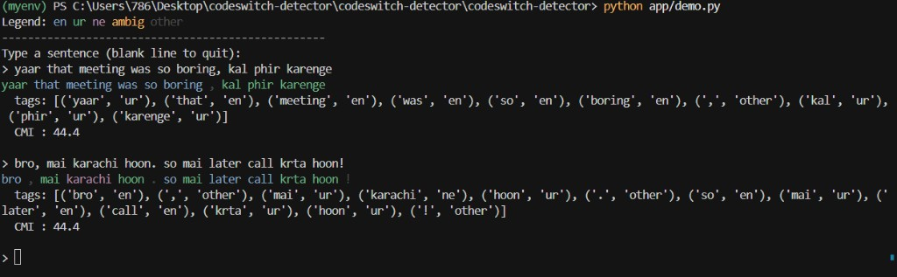

# Roman Urdu–English Code-Switching Detector

Token-level language identification for **code-switched** social-media text —
the kind of mixed-language writing people actually use:

> *yaar that meeting was so boring, kal phir karenge*

Most off-the-shelf NLP models treat this as broken English or broken Urdu.
This project tags **every word** with the language it belongs to, measures how
heavily a text is mixed, and ships a small demo. It's a clean sequence-labeling
problem applied to an underserved, real-world setting.

---

## What it does

Given a sentence, it labels each token:

| label   | meaning                                   | example          |
|---------|-------------------------------------------|------------------|
| `en`    | English                                   | *meeting, boring*|
| `ur`    | Roman Urdu                                | *yaar, karenge*  |
| `ne`    | Named entity (person/place/brand)         | *Karachi, Netflix* |
| `other` | symbol / number / url / @mention / #tag / emoji | *🙂, @ali, #plan* |
| `ambig` | valid in both languages                   | *to, is, par*    |

It also computes the **Code-Mixing Index (CMI)** — a standard 0–100 score for
how mixed an utterance is (0 = monolingual, ~50 = evenly mixed).

---

## Quickstart

```bash
pip install -r requirements.txt        # core needs only scikit-learn + numpy

python src/train.py                    # trains baseline -> models/baseline.pkl
python src/evaluate.py                 # 5-fold cross-validated metrics
python app/demo.py                     # interactive coloured CLI demo
python app/demo.py --web               # web demo (needs gradio)
```

Tag text from Python:

```python
from src.predict import load_tagger
tag = load_tagger()
tag("main office pohanch gaya bro traffic bohot tha")
# [('main','ur'), ('office','en'), ('pohanch','ur'), ('gaya','ur'),
#  ('bro','en'), ('traffic','en'), ('bohot','ur'), ('tha','ur')]
```

---

## Working examples

Interactive CLI demo (`python app/demo.py`) — colour-coded tokens, per-word tags, and CMI:



---

## How it works (the explainable bit)

```
raw text ─▶ tokenizer ─▶ per-token features ─▶ DictVectorizer ─▶ LogisticRegression ─▶ labels
```

The model is a **per-token logistic-regression classifier** — simple, fast, and
fully inspectable. Each token becomes a feature dictionary built from:

- **Character n-grams (2–4)**: the workhorse for word-level language ID.
  Roman Urdu has statistically distinctive substrings (`kh`, `gh`, `aa`,
  endings like `-ein`, `-on`, `-ay`) that separate it from English.
- **Lexicon membership**: is the word in an English list, an Urdu list, both,
  or neither? Strong, interpretable signal.
- **Word shape**: capitalization, length, doubled letters.
- **Light context**: what languages the neighbouring words belong to, which
  helps disambiguate words living in both languages.
---

## Results

5-fold **sentence-level** cross-validation on the seed set (folds split whole
sentences, not tokens, so near-identical contexts can't leak between train and
test — the honest, harder test):

```
            precision  recall  f1
   en          0.93     0.98   0.95
   ur          0.98     0.97   0.97
   ne          1.00     0.29   0.44
   other       0.96     0.96   0.96
   ambig       0.60     0.50   0.55
   accuracy                    0.95
   macro avg                   0.78
```

The headline accuracy (~0.95) is strong, but the **interesting story is in the
rare classes**: named entities and ambiguous words are hard, which is exactly
what you'd expect and what makes for a good discussion.

---

## Failure analysis (talk about this in interviews)

- **Named entities (`ne`)** are under-recalled — there are few examples and they
  look like ordinary words. Fixing this wants more data or a gazetteer.
- **Ambiguous words (`ambig`)** like *to / is / par* are genuinely undecidable
  without context; this is the linguistically interesting core of the problem.
- **Loanwords** — *office, phone, internet* are English-origin but used inside
  Urdu sentences; where to draw the line is a real annotation decision.
- **Dialect / spelling variation** — *bohot / bohat / bahut* all mean the same;
  character n-grams help, but coverage depends on your data.

Being able to name these failure modes is more impressive than the F1 score.

---

## Scaling the dataset

The seed set is small (intentionally — it's hand-labelled). To grow it without
labelling every token from scratch:

```bash
python src/weak_label.py raw_text.txt > weak_labeled.tsv   # auto-label
# then a human CORRECTS weak_labeled.tsv and appends it to data/seed_labeled.tsv
```

`weak_label.py` labels obvious tokens by rule + lexicon and falls back to the
trained model for unknown words. **Weak labels are noisy** — the workflow is
*bootstrap → human review → train*, never train blindly on them.

Good public sources to expand with: the FIRE code-mixing shared-task data,
the LinCE benchmark, and your own scraped Twitter/X / YouTube comments.

---

## Upgrade path

The baseline is deliberately the floor, not the ceiling:

1. **Add a CRF** (`sklearn-crfsuite`) on top of the same features for proper
   sequence modelling — neighbouring labels constrain each other.
2. **Fine-tune a transformer** — `xlm-roberta-base` is multilingual and a
   natural fit for token classification on code-switched text. Log the baseline
   numbers first so you have an honest comparison to point to.
3. **Downstream use** — use the tagger as a preprocessing step and show it
   improves sentiment classification on mixed text. That turns this into a
   two-stage story with measurable payoff.

---

## Project structure

```
codeswitch-detector/
├── data/
│   ├── seed_labeled.tsv          # hand-labelled CoNLL data
│   └── lexicons/                 # English + Roman Urdu word lists
├── src/
│   ├── tokenizer.py              # social-media-aware tokenizer
│   ├── dataset.py                # CoNLL + lexicon loaders
│   ├── features.py               # per-token feature extraction
│   ├── train.py                  # train the baseline
│   ├── evaluate.py               # cross-validated metrics + confusion matrix
│   ├── predict.py                # load model, tag text
│   ├── weak_label.py             # bootstrap labels for raw text
│   └── cmi.py                    # Code-Mixing Index
├── app/demo.py                   # CLI + optional Gradio web demo
├── tests/test_tokenizer.py
└── requirements.txt
```

## License / data note

The seed data here is small and synthetic-realistic, written for demonstration.
When you add scraped social data, respect each platform's terms of service and
remove personal/identifying information before sharing a public dataset.
